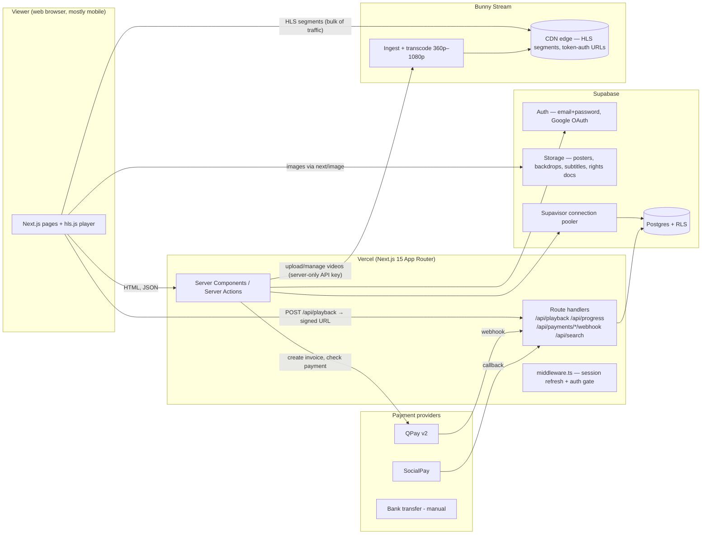
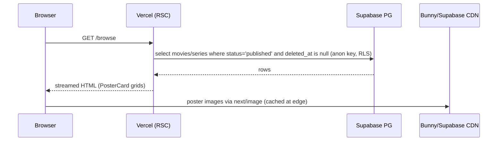
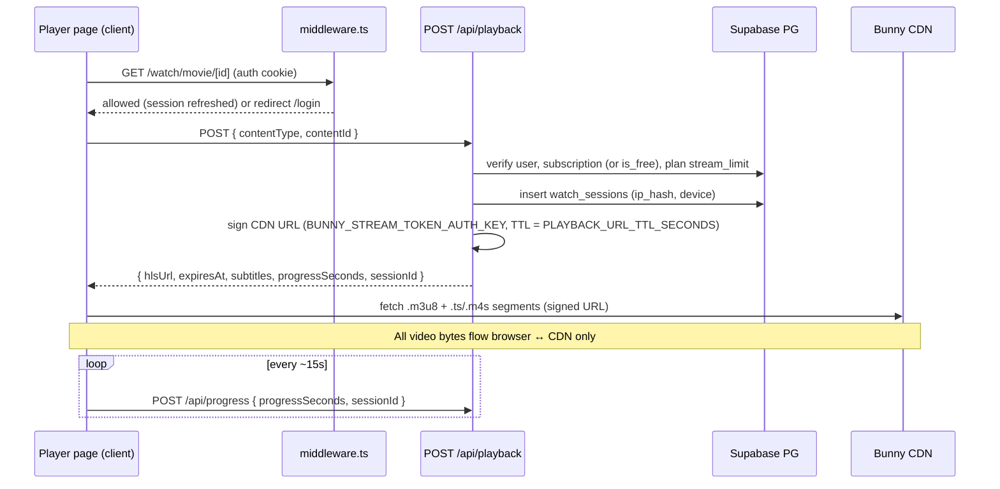
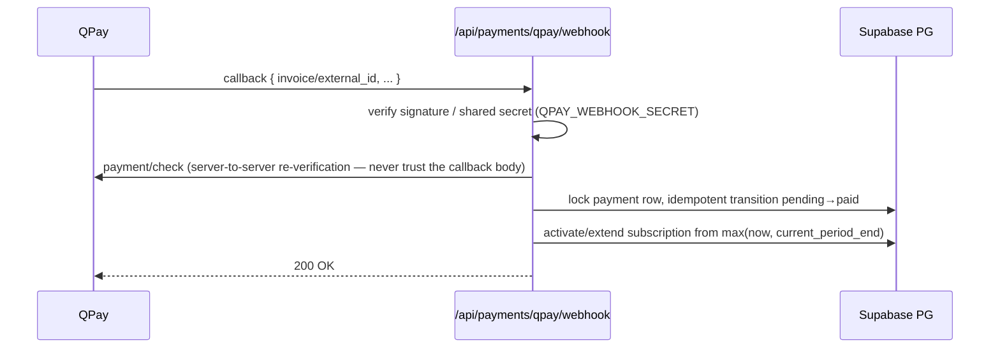

# 01 — Architecture

FLIMIX is a subscription video-on-demand (SVOD) platform for the Mongolian market. The
guiding constraint of the architecture is simple: **video bytes never pass through our
application servers.** Vercel serves HTML/JSON, Supabase serves data and auth, Bunny
Stream's CDN serves every video segment. Everything else follows from that.

## 1. System context

## 2. Components

| Component | Responsibility | Notes |
|---|---|---|
| **Next.js 15 on Vercel** | Rendering, server actions, route handlers, middleware auth gate | App Router, React 19, strict TS. Route groups: `(public)`, `(auth)`, `account`, `watch`, `admin`, `api` (see `docs/02-folder-structure.md`). |
| **Supabase Postgres** | All domain data (`src/types/db.ts` is the schema contract), RLS as the last line of defense | Accessed via `@supabase/ssr` clients in `src/lib/supabase/{client,server,admin}.ts`. |
| **Supabase Auth** | Email+password w/ verification, Google OAuth, password reset | Session cookies refreshed in `src/middleware.ts`. Details in `docs/04-auth-roles.md`. |
| **Supabase Storage** | Posters, backdrops, avatars, subtitle `.vtt` files, rights contract documents | Public buckets for artwork; private bucket + signed URLs for rights documents. |
| **Bunny Stream** | Video ingest, transcoding ladder (360/480/720/1080), HLS delivery via token-auth CDN URLs | Wrapped behind the `@/lib/video` provider abstraction (`bunny \| cloudflare \| aws \| mock` in `video_assets.provider`) so the vendor is swappable. |
| **QPay / SocialPay / bank transfer** | MNT payments | Behind the `@/lib/payments` adapter (`createInvoice`, `verifyAndApplyPayment`). Details in `docs/06-payments.md`. |

## 3. Request flows

### 3.1 Public browse (no auth)

Public pages are server components; they render on Vercel and are cacheable. The
published-content filter (`.eq("status","published").is("deleted_at",null)`) is applied
in every public query *and* mirrored in RLS, so a forgotten filter cannot leak drafts.

### 3.2 Authenticated playback (signed URL)

The full playback contract is in `docs/05-video-streaming.md`.

### 3.3 Payment webhook

Subscription state changes **only** from server-verified provider responses — never
from a browser redirect. See `docs/06-payments.md`.

## 4. Scaling story

### 4.1 Catalog: 300 → 2,000+ titles, no schema redesign

The schema is already normalized for the target size: junction tables
(`movie_genres`, `movie_cast`, …), a `popularity` numeric on movies/series, and
slug-based lookups with indexes. What changes as the catalog grows is *query shape*,
not schema:

- **300 titles (launch):** browse pages can select whole genre rows; Postgres full-table
  scans are cheap; search is `ilike`/trigram over `title_mn/title_en`.
- **~1,000 titles:** paginate browse/genre listings (keyset on `popularity, id`),
  add `pg_trgm` GIN indexes for search (extension already available in Supabase),
  cache homepage section queries with Next.js `revalidate`.
- **2,000+ titles:** same tables, same types. Homepage moves fully to the
  `homepage_sections` model (curated + `auto_query` sections) instead of ad-hoc
  queries; ISR/`revalidateTag` keeps public pages static-served. Nothing in
  `src/types/db.ts` needs to change — this was a design requirement.

### 4.2 Playback: 5,000 concurrent viewers

The load profile is deliberately lopsided:

| Traffic | Volume at 5,000 viewers | Handled by |
|---|---|---|
| HLS segments | ~5–15 Gbps sustained | **Bunny CDN only.** Zero bytes through Vercel or Supabase. |
| Playback token (`POST /api/playback`) | ~5,000 requests spread over session starts; bursty at prime time (new episode drop). Budget for ~50–100 rps peak | Vercel serverless — stateless, scales horizontally. Each call: 2–3 Postgres queries + 1 HMAC signature. |
| Progress writes (`POST /api/progress`) | 5,000 viewers × 1 write / 15 s ≈ **~330 writes/s** | Single-row upserts on `watch_progress` (PK `user_id+content_type+content_id`). Trivial for Postgres; the real constraint is *connections*, below. |
| Page renders | Mostly cached/ISR | Vercel edge cache |

**What actually needs capacity planning:**

1. **Postgres connections.** Vercel serverless can fan out to hundreds of concurrent
   lambdas, each wanting a connection. All server-side Supabase clients must connect
   through **Supavisor in transaction mode** (the pooled connection string, port 6543),
   not direct Postgres. With pooling, 330 writes/s of single-row upserts consumes a
   handful of real backend connections.
2. **Playback endpoint burst.** A popular premiere means thousands of `POST /api/playback`
   in a few minutes. Keep it lean (no joins beyond subscription + asset lookup), and
   rate-limit per user (see `docs/08-security.md`). Load-test this endpoint before
   launch (roadmap checklist).
3. **Progress write coalescing.** The client throttles to one write per ~15 s and flushes
   on `visibilitychange`/pause. If write volume ever matters, the fix is client-side
   (30 s interval) — no architecture change.

Explicitly **not** a concern: video egress (Bunny's problem, priced per GB),
transcoding (Bunny's encoder pool), image resizing (next/image + Vercel edge cache).

### 4.3 Mongolian mobile network considerations

Most FLIMIX viewers are on Unitel/Mobicom LTE, often metered, with real-world
throughput that swings between <1 Mbps and ~20 Mbps.

- **Adaptive bitrate ladder 360p–1080p.** The 360p rendition (~600 kbps) is the floor
  that keeps playback alive on congested cells; hls.js starts conservatively and ramps
  up. We do not ship 4K in MVP — it multiplies storage/egress cost for a small share of
  devices. Ladder details in `docs/05-video-streaming.md`.
- **Image discipline.** All artwork goes through `next/image` (AVIF/WebP, srcset per
  breakpoint). Poster cards target ≤ 30 KB each on mobile; hero backdrops lazy-load
  below the fold. Remote patterns are locked in `next.config.ts` to Supabase Storage,
  `*.b-cdn.net`, and TMDB.
- **Payload budgets.** Public pages are server components with minimal client JS; the
  only heavy client bundle is the player page (`hls.js`), which is code-split and loaded
  only on `/watch/*`. Target: ≤ 200 KB gzipped JS on landing/browse, LCP < 2.5 s on a
  throttled 4G profile.
- **Resilience.** Progress saves are fire-and-forget with retry; the player tolerates
  token refresh (re-POST `/api/playback`) after long pauses; skeleton components
  (`PosterSkeleton`, `RowSkeleton`) keep perceived latency low on slow fetches.

## 5. Environment boundaries

| Secret | Lives in | Never reaches |
|---|---|---|
| `SUPABASE_SERVICE_ROLE_KEY` | Vercel env, `@/lib/supabase/admin` (server-only) | Client bundle, logs |
| `BUNNY_STREAM_API_KEY`, `BUNNY_STREAM_TOKEN_AUTH_KEY` | Vercel env, `@/lib/video` server code | Client — the client only ever sees a *signed, expiring* URL |
| `QPAY_*`, `SOCIALPAY_*` | Vercel env, `@/lib/payments` server code | Client |
| `IP_HASH_SALT` | Vercel env | Client; raw IPs are never stored (only salted hashes) |

See `.env.example` for the full variable list and `docs/08-security.md` for handling rules.
