# FLIMIX — Database ERD & design decisions

Schema source of truth: `supabase/migrations/0001…0007` (mirrored by `src/types/db.ts`).
All tables use UUID primary keys (`gen_random_uuid()`), snake_case naming, and RLS enabled.

## 1. Entity groups

| Group | Tables |
|---|---|
| **Catalog** | movies, series, seasons, episodes, genres, countries, languages, cast_members, crew_members, movie_genres, series_genres, movie_cast, series_cast |
| **Media** | video_assets, subtitle_tracks, audio_tracks |
| **Users & engagement** | profiles, user_roles, favorites, watch_progress, watch_sessions, user_devices, notifications |
| **Billing** | subscription_plans, subscriptions, payments, payment_attempts, promo_codes |
| **Rights & partners** | content_partners, content_rights, content_right_documents, partner_revenue_shares |
| **Curation & ops** | homepage_sections, homepage_section_items, audit_logs, admin_notes |

## 2. Relationships (crow's foot)

```mermaid
erDiagram
    %% ---- catalog ----
    countries ||--o{ movies : "country_id"
    countries ||--o{ series : "country_id"
    series ||--|{ seasons : "series_id"
    seasons ||--|{ episodes : "season_id"
    genres ||--o{ movie_genres : ""
    movies ||--o{ movie_genres : ""
    genres ||--o{ series_genres : ""
    series ||--o{ series_genres : ""
    cast_members ||--o{ movie_cast : ""
    movies ||--o{ movie_cast : ""
    cast_members ||--o{ series_cast : ""
    series ||--o{ series_cast : ""

    %% ---- media ----
    video_assets ||--o{ movies : "playback_asset_id"
    video_assets ||--o{ episodes : "playback_asset_id"
    languages ||--o{ subtitle_tracks : "language_id"
    languages ||--o{ audio_tracks : "language_id"
    movies ||--o{ subtitle_tracks : "content_id (polymorphic)"
    episodes ||--o{ subtitle_tracks : "content_id (polymorphic)"

    %% ---- users & engagement ----
    auth_users ||--|{ profiles : "user_id"
    auth_users ||--|{ user_roles : "user_id"
    auth_users ||--o{ user_devices : "user_id"
    auth_users ||--o{ favorites : "user_id"
    movies ||--o{ favorites : "movie_id (xor)"
    series ||--o{ favorites : "series_id (xor)"
    auth_users ||--o{ watch_progress : "user_id"
    profiles ||--o{ watch_progress : "profile_id"
    auth_users ||--o{ watch_sessions : "user_id"
    user_devices ||--o{ watch_sessions : "device_id"
    auth_users ||--o{ notifications : "user_id"

    %% ---- billing ----
    subscription_plans ||--o{ subscriptions : "plan_id"
    auth_users ||--o{ subscriptions : "user_id"
    auth_users ||--o{ payments : "user_id"
    subscriptions ||--o{ payments : "subscription_id"
    payments ||--o{ payment_attempts : "payment_id"

    %% ---- rights & curation ----
    content_partners ||--o{ content_rights : "partner_id"
    content_partners ||--o{ partner_revenue_shares : "partner_id"
    content_rights ||--o{ content_right_documents : "content_right_id"
    movies ||--o{ content_rights : "content_id (polymorphic)"
    series ||--o{ content_rights : "content_id (polymorphic)"
    homepage_sections ||--o{ homepage_section_items : "section_id"
    movies ||--o{ homepage_section_items : "content_id (polymorphic)"
    series ||--o{ homepage_section_items : "content_id (polymorphic)"
    auth_users ||--o{ audit_logs : "actor_id"
    auth_users ||--o{ admin_notes : "author_id"
```

`auth_users` = Supabase `auth.users`. A trigger (`handle_new_user`, migration 0006)
creates a default `profiles` row and a `user_roles('user')` row on signup.

## 3. Key design decisions

### Soft delete on titles
`movies.deleted_at` / `series.deleted_at` (timestamptz, null = live). Public RLS
policies and app queries always filter `status = 'published' AND deleted_at IS NULL`.
Hard deletes are reserved for legal takedowns (cascades clean junctions/favorites).

### Polymorphic content references
Two enums split the two "shapes" of content reference:

- `content_type` (`movie | episode`) — *playable* targets: subtitle_tracks,
  audio_tracks, watch_progress, watch_sessions.
- `catalog_content_type` (`movie | series`) — *catalog* targets: content_rights,
  homepage_section_items. `favorites` instead uses two nullable FK columns
  (`movie_id`, `series_id`) with a CHECK enforcing exactly one, so it keeps real
  FKs + cascades.

Polymorphic `(content_type, content_id)` pairs have no FK; integrity is enforced at
the application layer and visibility at the RLS layer (policies join through to the
published parent).

### Roles
`user_roles` is a separate multi-row table (a user can hold several roles), with the
hierarchy `user < content_manager < admin < super_admin` encoded in
`role_rank()` / `has_role(uid, min_role)` (SECURITY DEFINER, used by ~40 policies).

### Rights model
`content_rights` stores a licensing window per title (`rights_start`/`rights_end`,
`allowed_countries`, `allowed_platforms`, exclusivity, revenue share) linked to a
`content_partners` row, with a `rights_approval_status` workflow
(pending → approved/rejected), supporting documents (`content_right_documents`) and
periodic settlement rows (`partner_revenue_shares`). A partial index on
`rights_end WHERE approval_status = 'approved'` powers the "expiring within 30 days"
admin warning.

### Payments
`payments` rows are created `pending`, and status transitions happen **only** in
server-verified webhook/polling code using the service role. Idempotency comes from
the partial unique index `(provider, external_id)`. Every provider round-trip is
recorded in `payment_attempts` for debugging/audit.

### Playback
`video_assets` holds unsigned provider paths and is **not** readable by anon or
plain users; the playback API checks entitlement (`is_subscriber()` or
`movies.is_free`), then signs URLs server-side and records a `watch_sessions` row
to enforce `subscription_plans.stream_limit`.

### Search & catalog indexes
`pg_trgm` GIN indexes on `title_mn`, `title_en`, `original_title` (movies + series)
for fuzzy Cyrillic/Latin search; b-tree indexes on `(status, published_at)`,
`release_year`, `country_id`, `popularity`, junction FKs,
`watch_progress(user_id, last_watched_at)`, `payments(user_id)`,
`subscriptions(user_id, status)`.

## 4. RLS summary

Roles below are additive (policies OR together). `service_role` bypasses RLS.

| Table(s) | anon | user (own rows) | content_manager | admin+ |
|---|---|---|---|---|
| movies, series, seasons, episodes | published only | published only | CRUD | CRUD |
| genres, countries, languages, cast, crew | read | read | CRUD | CRUD |
| junctions (genres/cast) | via published parent | via published parent | CRUD | CRUD |
| subtitle_tracks, audio_tracks | via published parent | via published parent | CRUD | CRUD |
| video_assets | — | — | CRUD | CRUD |
| homepage_sections/_items | published only | published only | CRUD | CRUD |
| subscription_plans | active only | active only | — | CRUD |
| profiles | — | CRUD own | — | read all |
| user_roles | — | read own | — | read (super_admin: CRUD) |
| favorites, watch_progress, user_devices | — | CRUD own | — | — (devices: read) |
| watch_sessions | — | read/insert/update own | — | read all |
| notifications | — | read/update/delete own | — | CRUD |
| subscriptions | — | read own | — | CRUD |
| payments | — | read own | — | read all (writes: service role only) |
| payment_attempts | — | — | — | read (writes: service role) |
| promo_codes | — | read valid+active | — | CRUD |
| content_partners, content_rights, right documents, revenue shares, admin_notes | — | — | — | CRUD |
| audit_logs | — | — | — | read (INSERT: service role only) |
