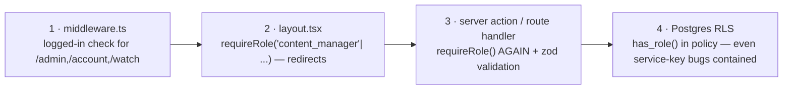

# 04 — Authentication & roles

## 1. Supabase Auth strategy

| Method | Status | Notes |
|---|---|---|
| Email + password | MVP | Email verification required before first login completes (`/verify-email` handles the confirmation link landing). |
| Google OAuth | MVP | `supabase.auth.signInWithOAuth({ provider: "google" })` from `/login`; callback returns through the same `@supabase/ssr` cookie flow. |
| Password reset | MVP | `/forgot-password` sends a recovery link; `/reset-password` consumes the recovery session and calls `auth.updateUser({ password })`. |
| Phone (SMS OTP) | **Phone-ready, not enabled** | Supabase Auth supports SMS OTP natively; when a Mongolian SMS gateway is contracted (Phase 2+), enabling it is config + one form — no schema change, since identity stays `auth.users`. |

All auth pages live in the `(auth)` route group (centered card layout): `login/`,
`register/`, `forgot-password/`, `reset-password/`, `verify-email/`.

## 2. Session handling (@supabase/ssr)

`src/middleware.ts` runs on every non-asset request and does two jobs:

1. **Session refresh.** Creates a `createServerClient` bound to request/response
   cookies and calls `supabase.auth.getUser()`, which transparently refreshes expired
   access tokens and rewrites the auth cookies on the response. Server components later
   in the same request see a valid session without doing refresh work themselves.
2. **Coarse auth gate.** If the path starts with `/admin`, `/account`, or `/watch` and
   there is no user, redirect to `/login?next=<path>`.

Two rules the codebase must never break:

- **Always `getUser()`, never trust `getSession()` alone** for authorization decisions —
  `getUser()` validates the JWT against Supabase; a cookie can be stale or forged.
  `src/lib/auth.ts#getSession()` follows this (it wraps `auth.getUser()`).
- Cookies are httpOnly + SameSite=Lax as issued by Supabase; no token ever lands in
  `localStorage`.

## 3. Role model

```
guest → user → subscriber → content_manager → admin → super_admin
        └────────┬────────┘
     "subscriber" is DERIVED, not a stored role
```

| Role | How it exists | Grants |
|---|---|---|
| `guest` | No session | Public pages, trailers, plan prices, free-flagged titles' detail pages |
| `user` | Any `auth.users` row (default; `user_roles` may be empty → treated as `user`) | Account area, favorites, watch free content |
| *subscriber* | **Derived**: `hasActiveSubscription(userId)` — a `subscriptions` row with status `active`/`trial` and `current_period_end > now()` | Playback of paid content, multi-profile features |
| `content_manager` | `user_roles` row | Admin panel: content, series, homepage curation (no publish w/o rights — see 07) |
| `admin` | `user_roles` row | Everything above + users, plans, rights approval, reports |
| `super_admin` | `user_roles` row | Everything + role grants, settings, audit access |

Subscriber is deliberately not a role row: subscription state changes constantly
(payments, expiry) and deriving it from `subscriptions` means it can never drift.
Staff roles change rarely and are audited, so they live in a table.

### Role storage: `user_roles`

```sql
create table public.user_roles (
  id          uuid primary key default gen_random_uuid(),
  user_id     uuid not null references auth.users(id) on delete cascade,
  role        public.user_role not null default 'user',
  granted_by  uuid references auth.users(id) on delete set null,
  created_at  timestamptz not null default now(),
  unique (user_id, role)
);
```

A user may hold several roles; the app resolves the *highest* via the ordering in
`src/lib/auth.ts` (`user < content_manager < admin < super_admin`). `granted_by` gives
a paper trail (plus an `audit_logs` row on every grant/revoke).

### `has_role()` in SQL (for RLS)

RLS policies cannot call TypeScript, so the same check exists as a `security definer`
function (defined with the RLS policies migration):

```sql
create or replace function public.has_role(min_role public.user_role)
returns boolean
language sql stable security definer set search_path = public as $$
  select exists (
    select 1 from public.user_roles ur
    where ur.user_id = auth.uid()
      and array_position(
            array['user','content_manager','admin','super_admin']::public.user_role[],
            ur.role)
          >= array_position(
            array['user','content_manager','admin','super_admin']::public.user_role[],
            min_role)
  );
$$;
```

`security definer` matters: `user_roles` itself is RLS-protected (users read only their
own rows), so policies on *other* tables need a definer function to consult it. It is
`stable`, so Postgres caches it per statement.

## 4. Defense in depth — four layers, every admin path



Why re-check at layer 3 when layer 2 already did? Because server actions are HTTP
endpoints: they can be invoked directly with a crafted request, bypassing any page
render. Layouts protect navigation; actions protect mutation; RLS protects data even
if application code is wrong. Layer 4 is why ordinary reads use the anon-key server
client — the service-role client (`createAdminClient()`) bypasses RLS and therefore
appears **only** after an explicit `requireRole()` in audited admin actions.

## 5. Child profiles & age gating

- Each `auth.users` account owns 1..n `profiles` rows; a profile may set
  `is_child_profile = true` and a `birth_date`.
- Content carries an `age_rating` (`G | PG | PG-13 | R | NC-17`) on movies and series.
- **Gating point:** the active profile is stored in a cookie; content listing queries
  for a child profile filter to `age_rating in ('G','PG')` (and `PG-13` when
  `birth_date` implies ≥ 13). `POST /api/playback` re-applies the same check
  server-side — a child profile cannot start an `R` stream even with a hand-crafted
  request.
- Switching *out* of a child profile can be PIN-protected (account-level PIN, Phase 2);
  MVP ships profile creation + filtering, with the enforcement point already in the
  playback API so the UX layer can evolve without security changes.
- This is honesty-first: age gating protects children from stumbling into content on a
  shared account; it is not parental DRM. `legal/child-safety` documents the policy for
  users.

## 6. Flows at a glance

```mermaid
sequenceDiagram
    participant U as User
    participant N as Next.js
    participant SA as Supabase Auth

    rect rgb(40,40,60)
    note over U,SA: Register (email + password)
    U->>N: /register form (zod-validated server action)
    N->>SA: auth.signUp(email, password)
    SA-->>U: verification email
    U->>N: clicks link → /verify-email
    N->>SA: exchange token, session cookies set
    end

    rect rgb(40,50,45)
    note over U,SA: Password reset
    U->>N: /forgot-password
    N->>SA: resetPasswordForEmail(redirectTo=/reset-password)
    U->>N: recovery link → /reset-password
    N->>SA: updateUser({ password })
    end
```


