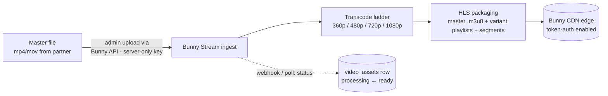
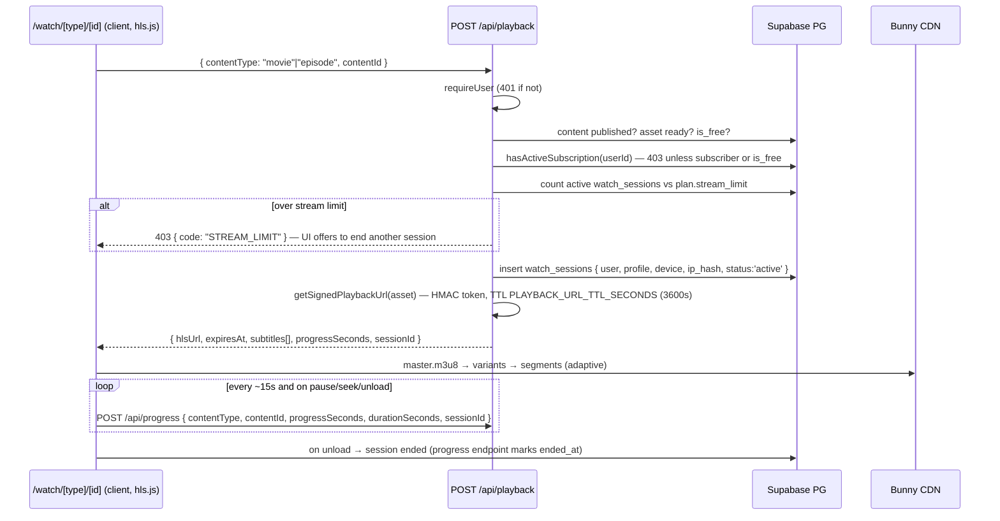

# 05 — Video streaming

## 1. Pipeline: upload → transcode → HLS



- Content managers upload masters from the admin panel; the server (never the browser)
  talks to Bunny with `BUNNY_STREAM_API_KEY` and records a `video_assets` row:
  `{ provider: "bunny", provider_video_id, hls_path, qualities, status: "processing" }`.
- When Bunny finishes transcoding, status flips to `ready` and the movie/episode's
  `playback_asset_id` can be wired up. **Publish is blocked until the asset is `ready`**
  (and rights are approved — see `docs/07-admin-structure.md`).

### Bitrate ladder (tuned for Mongolian LTE)

| Rendition | Resolution | ~Video bitrate | Purpose |
|---|---|---|---|
| 360p | 640×360 | ~600 kbps | Floor for congested cells / metered data |
| 480p | 854×480 | ~1.2 Mbps | Typical mobile |
| 720p | 1280×720 | ~2.8 Mbps | Default on wifi |
| 1080p | 1920×1080 | ~5 Mbps | TVs / desktop |

No 4K in MVP — cost multiplier without audience. The ladder is stored per asset in
`video_assets.qualities` so future changes are per-title, not global.

## 2. Playback flow



Contract (binding, from CONVENTIONS):

- `POST /api/playback` body `{ contentType: "movie"|"episode", contentId: string }` →
  `403` unless subscriber (or `movie.is_free`); returns
  `{ hlsUrl, expiresAt, subtitles: SubtitleTrack[], progressSeconds: number, sessionId: string }`.
  Creates a `watch_sessions` row and enforces `plan.stream_limit`.
- `POST /api/progress` body `{ contentType, contentId, progressSeconds, durationSeconds, sessionId }`
  → upserts `watch_progress`, sets `completed = true` when ≥ 95 %.

### Signed URLs

`@/lib/video` exposes exactly:

```ts
export interface SignedPlayback { hlsUrl: string; expiresAt: string; }
export async function getSignedPlaybackUrl(asset: VideoAsset): Promise<SignedPlayback>;
```

The Bunny adapter builds a CDN token-auth URL: SHA256 HMAC over
(`BUNNY_STREAM_TOKEN_AUTH_KEY` + path + expiry), appended as `?token=...&expires=...`
on `https://{BUNNY_STREAM_CDN_HOSTNAME}/{hls_path}`. TTL is
`PLAYBACK_URL_TTL_SECONDS` (default 3600 s). When the token nears expiry mid-film
(long pause), the player silently re-POSTs `/api/playback` and swaps the source at the
same position. The **mock** provider returns the public Mux test stream
(`https://test-streams.mux.dev/x36xhzz/x36xhzz.m3u8`) so local dev needs no Bunny account.

### Player

hls.js on `/watch/[type]/[id]` (the one heavy client bundle in the app, code-split to
this route). Native HLS (Safari/iOS) plays the same URL without hls.js. Features:
resume prompt from `progressSeconds`, quality auto/manual selector, subtitle selector,
intro-skip button on episodes (`intro_start_seconds`/`intro_end_seconds`), next-episode
autoplay.

## 3. Resume & progress

- `watch_progress` is one row per (user, content) — upserted, not appended. `completed`
  at ≥ 95 % drives "watched" badges and next-episode logic.
- The player throttles writes to ~15 s and always flushes on pause, seek, and
  `visibilitychange` (mobile tab kills are the common exit path on Android).
- `watch_history` semantics come from `watch_progress` + `watch_sessions` — sessions
  are the append-only log, progress is the resume state.

## 4. Subtitles & audio tracks

- `subtitle_tracks`: WebVTT files in Supabase Storage, rows keyed by
  (`content_type`, `content_id`, `language_id`), `is_default` for Mongolian. Delivered
  as `<track>` elements / hls.js subtitle list from the playback response.
- `audio_tracks`: metadata rows describing the audio languages muxed into the HLS
  master (e.g. original + Mongolian dub). Selection is HLS-native (`#EXT-X-MEDIA`);
  the table exists so the UI can label tracks in Mongolian and the catalog can filter
  "Монгол хадмал/дуу оруулгатай".

## 5. Device & concurrent stream limiting

- `user_devices` registers each device on login (name, type, user_agent); the account
  area lists and revokes them. Plan `device_limit` caps registrations (enforcement UI
  in Phase 2, schema ready now).
- **Concurrent streams** are enforced *now*, in `/api/playback`: count `watch_sessions`
  with `status = 'active'` and `started_at` within a liveness window for the user; if
  ≥ `plan.stream_limit`, refuse with `STREAM_LIMIT` and let the user terminate an old
  session (sets `status = 'terminated'`). Sessions without progress pings for
  > 2 minutes are treated as dead so a crashed tab never locks the account.

## 6. Anti-abuse

- `watch_sessions.ip_hash` — SHA-256 of (IP + `IP_HASH_SALT`); raw IPs never stored
  (privacy) but sharing patterns remain detectable.
- Anomaly heuristics (admin report, not automatic bans in MVP): one account streaming
  from many distinct `ip_hash`es in a day; sessions overlapping from different device
  types beyond plan limits; token-refresh frequency far above normal.
- Signed URL TTL means a shared link dies within the hour, and it only ever serves the
  HLS path it was signed for.
- Playback endpoint is rate-limited per user (see `docs/08-security.md`).

## 7. DRM — honest statement

What we ship (MVP): **signed, short-lived CDN URLs + server-side entitlement checks +
stream limits.** This deters casual sharing — a copied link expires, and an account
being shared hits stream/device limits.

What it is **not**: content encryption. A determined user with dev tools can save
segments, and *no* technology prevents screen recording of decoded video —
including full DRM (analog hole).

Browser DRM (Widevine L3/L1, FairPlay via a DRM service such as EZDRM/Axinom, with a
provider that supports CENC/CBCS packaging) is a **Phase 3 option**, to be adopted if
content partners contractually require it. Even then, screen recording cannot be fully
prevented; DRM raises the effort bar, it does not eliminate piracy. Rights contracts
(`content_rights.allowed_platforms`) should be negotiated with this stated plainly.

## 8. Provider abstraction

`video_assets.provider` is `"bunny" | "cloudflare" | "aws" | "mock"`. All provider
specifics live behind `@/lib/video`:

| Concern | Bunny today | Swap path |
|---|---|---|
| Ingest/transcode | Bunny Stream API | Cloudflare Stream / AWS MediaConvert adapter implementing the same upload + status functions |
| URL signing | Token-auth HMAC | Cloudflare signed tokens / CloudFront signed URLs — same `getSignedPlaybackUrl` signature |
| Playback | Standard HLS | Unchanged — hls.js doesn't care who serves the playlist |

Because `hls_path` + `provider_video_id` are stored per asset, a migration can run
**per title** (re-ingest, flip the row) with zero player changes and no downtime.
