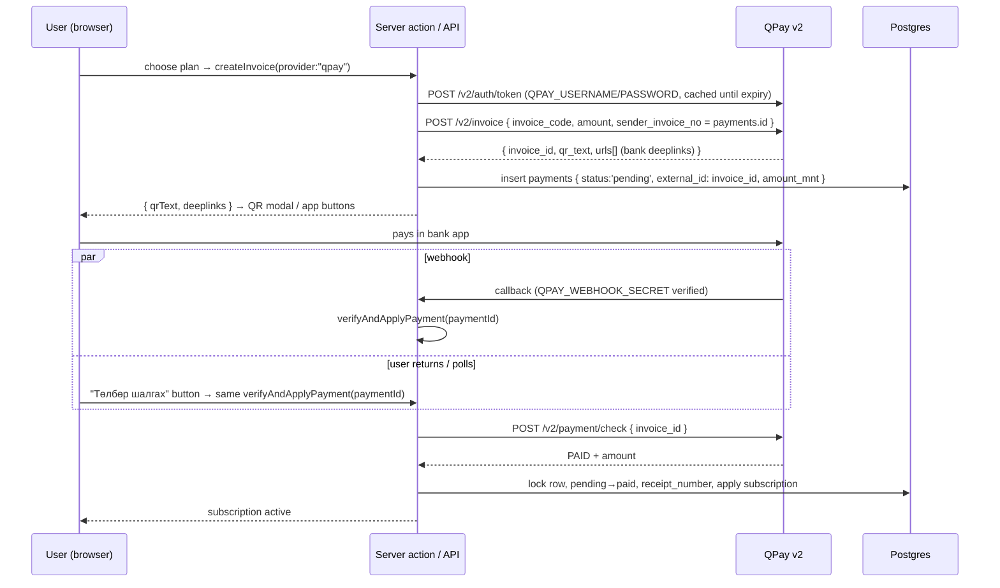
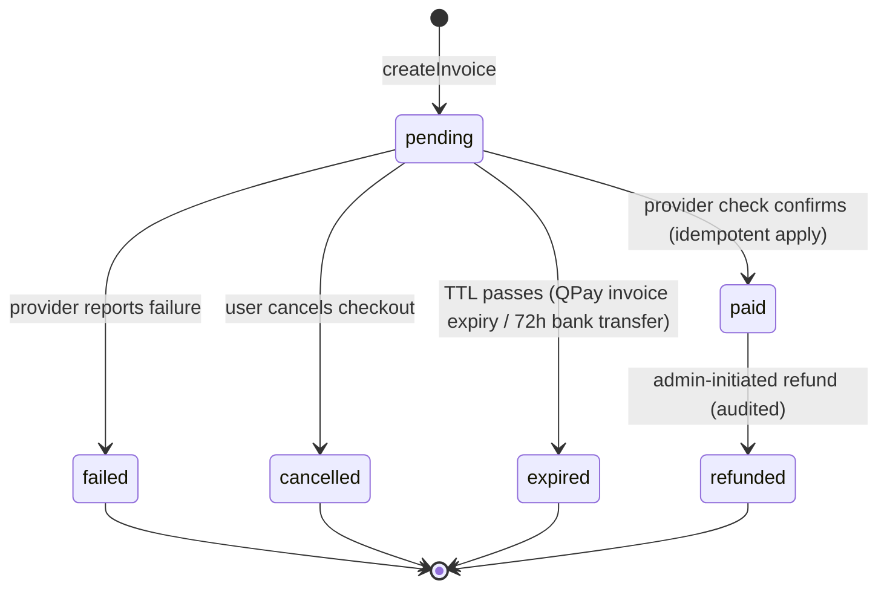
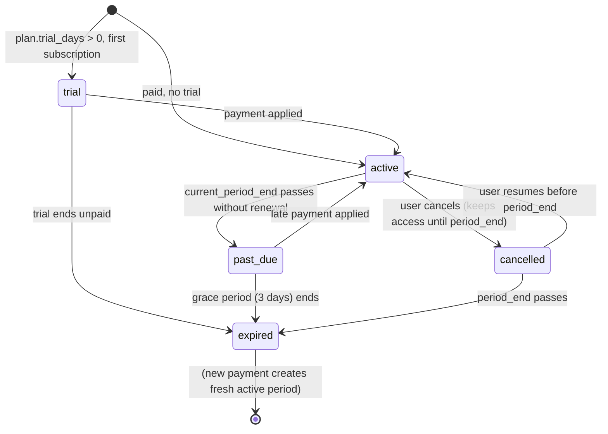

# 06 — Payments

All money flows through `@/lib/payments`, a thin adapter layer with exactly two public
functions (binding contract from CONVENTIONS):

```ts
export interface InvoiceResult {
  paymentId: string;        // payments.id
  checkoutUrl?: string;     // redirect-style providers
  qrText?: string;          // QPay QR content
  deeplinks?: { name: string; link: string }[];  // bank-app deeplinks
}
export async function createInvoice(input: {
  userId: string; planId: string; provider: PaymentProvider; promoCode?: string;
}): Promise<InvoiceResult>;

export async function verifyAndApplyPayment(paymentId: string): Promise<PaymentStatus>;
```

Consumers (subscribe page, account/subscription) call these via server actions and
**never** implement provider HTTP themselves. Providers: `qpay | socialpay |
bank_transfer | manual` (`payments.provider`).

## 1. The rule that governs everything: never trust the browser

A redirect back from a payment app, a `success=true` query param, a webhook body —
none of these grant a subscription. The **only** code that transitions a payment to
`paid` is server code that has re-verified with the provider
(`verifyAndApplyPayment` → provider `payment/check`). Webhooks are treated as
*hints to go verify*, not as facts.

## 2. QPay v2 flow



Both paths (webhook and user-initiated check) converge on the same idempotent
`verifyAndApplyPayment` — QPay webhooks are best-effort, so the polling path is not a
fallback, it is a co-equal path.

## 3. SocialPay flow

Same shape, different transport: `createInvoice` calls SocialPay's invoice API
(`SOCIALPAY_TERMINAL_ID` + request signing with `SOCIALPAY_SECRET_KEY`), returns a
`checkoutUrl` (redirect/in-app), provider calls back to
`/api/payments/socialpay/webhook`, and `verifyAndApplyPayment` re-checks with the
SocialPay inquiry endpoint before applying. The adapter differences (auth style,
signature format, status codes) stay inside `@/lib/payments`; the checkout UI is
provider-agnostic off `InvoiceResult`.

## 4. Bank transfer (manual verification)

For users without QPay/SocialPay:

1. `createInvoice(provider:"bank_transfer")` creates a `pending` payment and shows the
   FLIMIX account number + the payment id as the mandatory transfer reference.
2. Payment sits `pending`; a reminder notification fires if unpaid after 24 h;
   auto-`expired` after 72 h.
3. Admin reconciles bank statements in `/admin` (payments view), matches the reference,
   and marks paid — which routes through the **same** apply routine (and writes an
   `audit_logs` row; `provider:"manual"` marks admin-granted comps).

## 5. App Store / Google Play (future note)

Phase 3 mobile apps must use store billing for in-app subscription sales (store
policy). Plan: server-side receipt validation endpoints
(`verifyAndApplyPayment`-style), store products mapped to `subscription_plans` rows,
`payments.provider` extended with `app_store | google_play`. The subscription lifecycle
model below already accommodates externally-renewed periods. Expect 15–30 % store fees;
pricing per channel is a product decision, not an engineering one.

## 6. State machines

### Payment



`paid` is terminal except for `refunded`. There is no `paid → pending`; a re-purchase
is a new `payments` row.

### Subscription



`hasActiveSubscription()` treats `trial` and `active` with `current_period_end > now()`
as entitled — matching `src/lib/auth.ts` exactly.

## 7. Idempotency

Webhooks retry; users double-click; both paths race. Defenses, in order:

1. **Unique `external_id`** on `payments` — the provider's invoice id maps to exactly
   one row; a duplicate webhook cannot create a second payment.
2. **Row lock + status re-check before apply.** `verifyAndApplyPayment` runs
   `select ... for update` on the payment row; if status is already `paid`, return
   `paid` and do nothing. The subscription extension therefore executes at most once
   per payment.
3. **Provider re-check every time.** Even a signature-valid webhook triggers a
   `payment/check` before any transition.

## 8. Subscription lifecycle math

Renewal must never punish early payment:

```
new_period_end = max(now(), current_period_end) + plan.duration_days
```

- Renew 3 days early → 3 days are preserved, not lost.
- Renew after expiry → period starts now, no retroactive gap billing.
- Promo `bonus_days` add onto the same formula; `discount_percent` adjusts
  `amount_mnt` at invoice time (both recorded on the payment for reporting;
  `promo_codes.used_count` incremented atomically inside the apply transaction).

## 9. Receipts & records

- `payments.receipt_number` stores the provider receipt (QPay gives an e-barimt-capable
  id); the account area lists payment history with amounts (`formatMnt`), dates,
  provider, and receipt number.
- `payment_attempts` (table) records each verification attempt/response summary for
  support forensics — **excluding** any card/account credentials, which are never seen
  by FLIMIX at all (payments happen inside bank apps) and must never be logged.

## 10. Webhook endpoint hygiene

- `/api/payments/{qpay,socialpay}/webhook` verify the provider signature / shared
  secret (`QPAY_WEBHOOK_SECRET`, `SOCIALPAY_SECRET_KEY`) before touching the DB;
  unverified requests get `401` and a log line, nothing else.
- Handlers respond `200` quickly after enqueueing/executing verification — provider
  retry storms must not amplify into DB load.
- Full security posture in `docs/08-security.md`.
