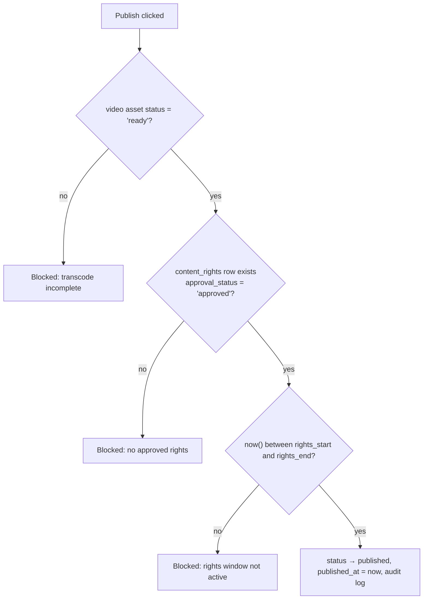

# 07 — Admin panel structure

The admin panel lives at `src/app/admin/` with its own sidebar layout, gated at four
layers (middleware → layout `requireRole` → per-action `requireRole` → RLS,
see `docs/04-auth-roles.md`). All copy is Mongolian; identifiers are English.

## 1. Information architecture (route list)

| Route | Purpose |
|---|---|
| `/admin` | Overview dashboard: subscriber count, MRR (MNT), payments today, top titles by watch_sessions, transcode queue, expiring rights warnings |
| `/admin/content` | Movies CRUD: metadata (mn/en), artwork, genres/cast/crew, video asset upload + transcode status, publish workflow |
| `/admin/series` | Series → seasons → episodes tree; per-episode assets, intro markers, bulk episode upload |
| `/admin/rights` | Content rights registry: partner, contract number, rights window, territories/platforms, exclusivity, revenue share %, approval workflow, contract document uploads |
| `/admin/users` | User search, subscription state, role grants (super_admin only), device/session view, comp subscriptions (`provider:"manual"`) |
| `/admin/plans` | Subscription plans + promo codes CRUD |
| `/admin/homepage` | Homepage sections: layout (hero/row/grid/banner), manual item picking or auto queries, ordering, scheduling, device visibility |
| `/admin/reports` | Views/completions per title, revenue by plan/provider, partner revenue-share reports, CSV export |
| `/admin/audit` | `audit_logs` browser: filter by actor, action, entity, date |
| `/admin/settings` | Platform settings, legal page content, feature flags |

## 2. Role-gating matrix

`admin/layout.tsx` requires `content_manager` minimum (else redirect). Each section
then enforces its own floor — in the section layout **and again** inside every server
action.

| Route | content_manager | admin | super_admin |
|---|:---:|:---:|:---:|
| `/admin` (overview) | ✔ (content stats only) | ✔ | ✔ |
| `/admin/content` | ✔ | ✔ | ✔ |
| `/admin/series` | ✔ | ✔ | ✔ |
| `/admin/homepage` | ✔ | ✔ | ✔ |
| `/admin/rights` | view + submit for approval | ✔ approve/reject | ✔ |
| `/admin/users` | — | ✔ (no role grants) | ✔ (incl. role grants) |
| `/admin/plans` | — | ✔ | ✔ |
| `/admin/reports` | content reports only | ✔ (incl. revenue) | ✔ |
| `/admin/audit` | — | ✔ read | ✔ |
| `/admin/settings` | — | — | ✔ |

Notable splits:

- **content_manager** can prepare everything but cannot approve rights, see revenue,
  or touch users. They *can* submit a rights record, which lands `pending` for an admin.
- **Role grants are super_admin only**, and a super_admin cannot demote themselves
  (guard in the action) so the platform can never end up with zero super_admins.

## 3. The `runAdminAction` pattern

Every admin mutation goes through one wrapper so that authorization and auditing can
never be individually forgotten:

```ts
// src/lib/admin.ts (shape)
export async function runAdminAction<T>(opts: {
  minRole: UserRole;                       // floor for this action
  action: string;                          // "movie.publish", "rights.approve", ...
  entityType: string; entityId?: string;
  input: unknown; schema: z.ZodType<T>;    // zod-validate BEFORE touching data
  run: (ctx: { session: SessionInfo; admin: SupabaseClient; input: T }) => Promise<void>;
}) {
  const session = await requireRole(opts.minRole);   // re-check, always
  const input = opts.schema.parse(opts.input);
  const admin = createAdminClient();                 // service role — only after the check
  await opts.run({ session, admin, input });
  await admin.from("audit_logs").insert({
    actor_id: session.userId, action: opts.action,
    entity_type: opts.entityType, entity_id: opts.entityId ?? null,
    details: redact(input),                          // never log secrets/passwords
    ip_hash: hashIp(currentIp()),
  });
}
```

Rules: no `createAdminClient()` outside this wrapper in admin code; `details` is
redacted (no credentials, no tokens); audit insert failure fails the action loudly
rather than silently skipping the trail.

## 4. Publish guard

**No content goes public without approved, unexpired rights.** The publish action for
movies/series/episodes checks, inside the transaction:



The same check runs as a publish-time guard **and** as a nightly sweep: content whose
`rights_end` has passed is auto-unpublished (`status → unpublished`) with an audit row
and an admin notification. The `/admin` overview surfaces rights expiring within 30
days. Episodes inherit the series' rights record.

## 5. CSV import / export

- **Export:** reports (`/admin/reports`) and content lists export CSV, generated
  server-side in a route handler after `requireRole` — UTF-8 with BOM so Excel renders
  Cyrillic correctly.
- **Import:** bulk metadata import (content managers migrating a back-catalog):
  upload CSV → server parses and zod-validates per row → preview screen with per-row
  errors → confirmed rows insert as `draft` (never published by import) → one audit
  log entry with row counts. Import never touches `status`, rights, or assets.

## 6. Homepage section scheduling model

`homepage_sections` + `homepage_section_items` drive the landing page without deploys:

| Field | Behavior |
|---|---|
| `layout` | `hero` (top banner), `row` (ContentRow scroller), `grid`, `banner` (promo) |
| `query_type` | `manual` → curated `homepage_section_items` (with `sort_order`); `auto` → `auto_query` JSON (e.g. `{ "genre": "action", "sort": "popularity", "limit": 12 }`) executed server-side against published content only |
| `sort_order` | Section order on the page |
| `visible_from` / `visible_until` | Scheduling window — a New Year collection can be staged in December, appear Dec 31, vanish Jan 3, no human awake required |
| `device_visibility` | `["web","mobile","tv"]` — future clients filter sections without schema change |
| `status` | `draft` sections are invisible publicly regardless of dates |

The public landing page queries: `status = 'published' AND (visible_from IS NULL OR
visible_from <= now()) AND (visible_until IS NULL OR visible_until > now())`, ordered
by `sort_order` — plus the standard published-content filter on every item resolved.
Admin preview mode renders draft sections for staff only.
